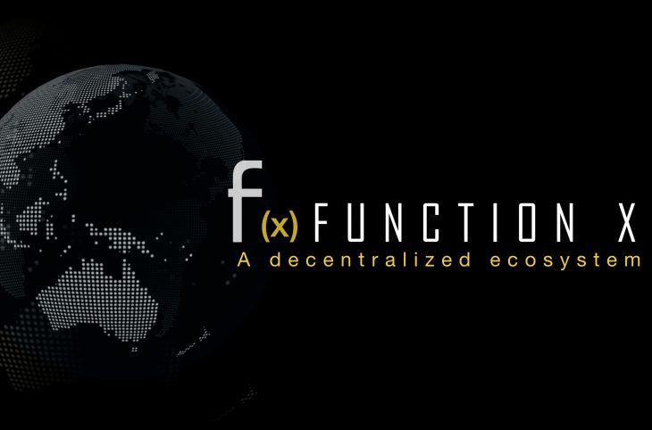

<!--
parent:
  order: false
-->

  <h1>FunctionX ($FX) - FXCore API library for Java</h1>

  

## Introduction

FunctionX ($FX) is a decentralized ecosystem relying on the Cosmos SDK.

FXCore is the main blockchain ($FX) upon which is relying the PundiX ($PUNDIX) on-chain payment system.

This Java API allows you to interface to a FunctionX mainnet/testnet node in order to use its RPC REST interface (usually on port 1317) or the gRPC interface (usually on port 9090).

## Quick start

First, you need to make sure the node's API (REST and/or gRPC) is enabled.

In order to do that, go into the node's configuration directory (usually ~/.fxcore/config), and modify the 'app.toml' and 'config.toml' files so that enable=true, and restart your node (`sudo systemctl restart fxcored`).

 

Have a look at the 'Example.java' class to understand how to use it.

## Useful to know

Some latest modules of the Cosmos SDK are not yet implemented into the FXCore mainnet or testnet nodes (authz, nft, etc.) but methods are already provided.
When used, they might return an error ("not implemented").

## To be achieved

Implementation of error messages.

## Testing

This library is not yet fully tested. So please be indulgent.

## Updates
- v0.1.0 : initial draft version
- v0.2.0 : refactoring of the packages - addition of the tendermint module - fix : dates
- v0.3.0 : addition of the following modules: authz, evidence, feegrant, group, tx, upgrade
- v0.4.0 : fixed : durations, QueryPoolResponse, QueryValidatorsResponse, pagination, tx - added : 'ibc' and 'other' modules, transaction decoding, QueryGasPriceResponse
- v0.5.0 : added real message deserialization, and default behaviour for unknown messages
- v0.5.1-5 : added all proposal types deserialization, fix govProposals, improve javaDoc (RestService) - fixed : eu.frenchxcore.cosmossdk.types.gov.v1beta1.Proposal and eu.frenchxcore.cosmossdk.types.gov.v1beta2.Proposal (withdrawEnableAddr to Boolean)
- v0.6.0 : added gRPC proto interface.
- v0.6.1-2 : fixed : eu.frenchxcore.cosmossdk.types.gov.v1beta1.Proposal and eu.frenchxcore.cosmossdk.types.gov.v1beta2.Proposal (votingEndTime)
- v0.6.3 : refactoring
- v0.7.0 : Cosmos and Tendermint RPC APIs are fully integrated (from OpenAPI) in api.cosmossdk and api.tendermint packages. Code was refactored (model and api packages).
- v0.7.0 : Previous APIs were tested further : CosmosGrpcApi, CosmosRestApi.
- v0.7.2 : Bugs corrected. Added 'height' parameter to CosmosGrpcApi.
- v0.7.3-v0.8.0 : Bugs corrected. Completed CosmosGrpcApi with tendermint base features, service and transaction methods.
- v0.8.1 : normalization of CosmosGrpcApi method names.
- v0.8.2 : addition of gravity, crosschain and ibc module query and message methods.
- v0.8.3 : Splitting CosmosGrpcApi in 2 : CosmosGrpcApi and TendermintGrpcApi. Started full java-documenting CosmosGrpcApi. 

Have fun !
